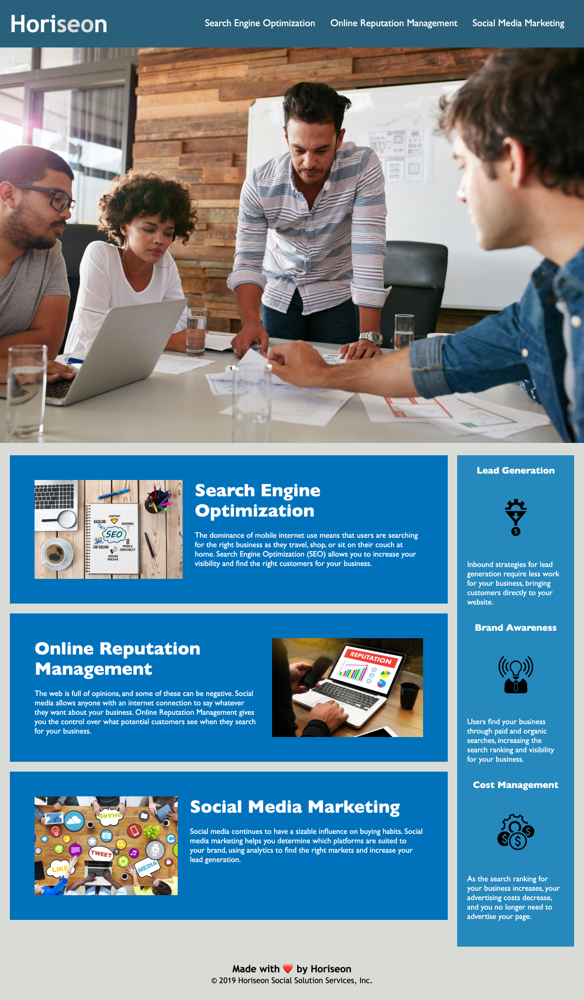

# Codebase Accessibility Refactor

The purpose of this project is to improve the accessbility of source code for Horiseon web application so that to meet the acceptance criteria. Adjustment has been applied to both html and CSS file, and below are the adjustment details.

## html:

* Change the title of web application to a descriptive one
* Change some tags to the more meaningful semantic tags
* Fix the problem of link to Search Engine Optimization
* Add space between the tag containers and make the code cleaner
* Some class selectors are changed to id selectors since they only styles unique element
* Simplify and consolidated some fussy class names since they have the same style
* Add alt attribute text to images and aria-lable for background image

## CSS:

* Correct the selectors' name to match the changes in html file
* Combine the classes with same style to elements
* Reorganize the order of selectors so that it follows the semantic structure of html file
* Add some comments to explain how the elements are styled

## Web application appearance and functionality

The web application resembles after adjustment:

## URL source
Feel free to check the web application: [https://ywen26.github.io/codebase-accessibility-refactor/](https://ywen26.github.io/codebase-accessibility-refactor/)

And github repository: [https://github.com/ywen26/codebase-accessibility-refactor](https://github.com/ywen26/codebase-accessibility-refactor)

